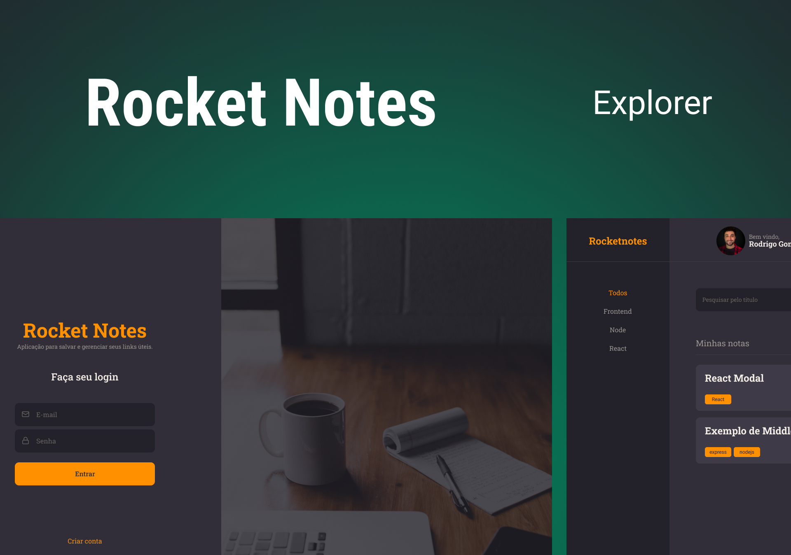

<h1 align="center">RocketNotes</h1>

  <a href="#-tecnologias">Tecnologias</a>&nbsp;&nbsp;&nbsp;|&nbsp;&nbsp;&nbsp;
  <a href="#-projeto">Projeto</a>

  

## 🚀 Tecnologias

Esse projeto foi desenvolvido com as seguintes tecnologias:

- Vite
- JavaScript
- React
- React-Icon
- React-Router-Dom
- Styled-Components
- Git e Github
- Figma

Bibliotecas

- [Google Fonts](https://fonts.google.com/)

## 💻 Projeto

O RocketNotes utiliza é uma aplicação para salvar e gerenciar links úteis.

- [Acesse o projeto finalizado, online]()

---

Feito com ♥ by Kauã :wave: